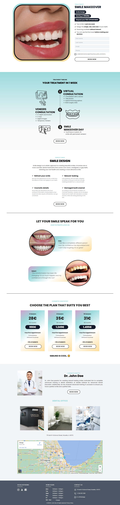
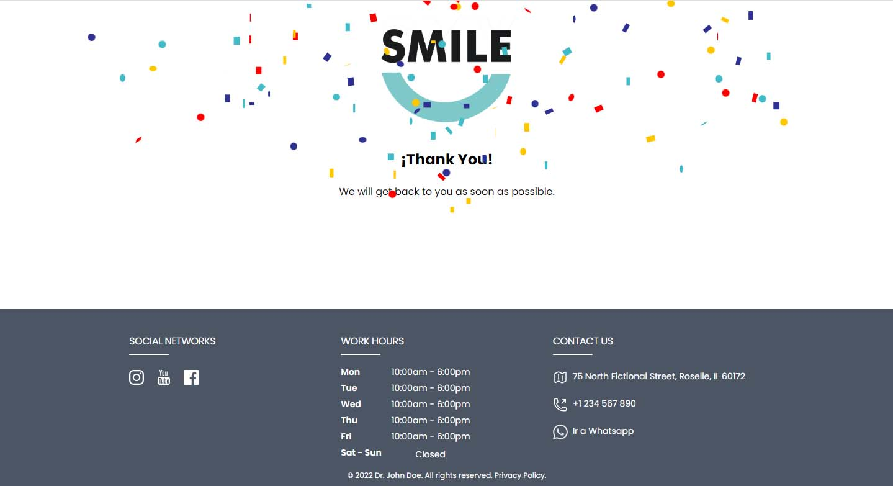

# Smile landing - A marketing landing page

This is a full stack application consisting of a landing page with dummy data about a digital marketing campaign to attract new patients for cosmetic dental treatments. It includes automated CRM registration and conversion tracking.

In addition to client-side tracking via the Facebook pixel and Google Analytics, all traffic is also received server-side to reduce the advertiser's cost per action by sending better data to Facebook's algorithm (Facebook handles the deduplication process accordingly). Concerns about cookies, GDPR and all things privacy are not covered yet.

## Table of contents

- [Overview](#overview)
  - [Features](#the-challenge)
  - [Screenshot](#screenshot)
  - [Links](#links)
- [My process](#my-process)
  - [Built with](#built-with)
  - [Useful resources](#useful-resources)
- [Author](#author)

## Overview

### Features

- Page view event from both client and server (`ViewContent` standard event on page load).
- Lead event from both client and server when the user completes the form.
- Lower advertiser cost per result (CPL) by increasing the [match quality of Facebook events](https://www.facebook.com/business/help/765081237991954?id=818859032317965) using additional properties thanks to [Cloudflare edge](https://developers.cloudflare.com/workers/runtime-apis/request#incomingrequestcfproperties) (country, city, etc).
- Google Analytics tracking.
- SEO component to add metadata to each page and tell search engines what the page is about.
- Form-level validation for user data.
- User data is automatically saved in the CRM application when the conversion takes place.
- All images served with web-optimized next-gen image format (AVIF and WebP) for better compression and performance.
- The CTA buttons below the fold trigger a lightbox form for user registration.
- Confetti explosion when the user converts to a lead and lands on the [thank you page](https://smile-landing.gerardocastillo.me/registration-completed).

### Screenshot

### Links

- GitHub URL: [GitHub repo](https://github.com/gerrcass/smile-landing)
- Live Site URL: [Smile landing deployed on Cloudflare Pages](https://smile-landing.gerardocastillo.me/)

## My process

How fast the website loads is one of the most important technical factor when it comes to lead conversion. It is widely known that short attention span audience starts to drop off and that's why I chose SvelteKit because it has minimal overhead and it's easier to build high performing sites.

### Built with

- [SvelteKit](https://kit.svelte.dev/) - A framework for building extremely high-performance web apps.
- [Tailwind CSS](https://tailwindcss.com/) - A utility-first CSS framework.
- [Svelte forms lib](https://github.com/tjinauyeung/svelte-forms-lib) - A Formik inspired library for building forms easily in a Svelte project.
- [yup](https://www.npmjs.com/package/yup) - A JavaScript schema builder for value parsing and validation.
- [vite-imagetools](https://www.npmjs.com/package/vite-imagetools) - A toolbox that helps transform images at compile time (powered by sharp).
- Mobile-first workflow
- Semantic HTML5 markup

### Useful resources

- [Facebook Conversions API](https://developers.facebook.com/docs/marketing-api/conversions-api/) - A server-side tool that allows advertisers to send web events from their servers to Facebook.
- [HubSpot CRM](https://www.hubspot.com/products/crm) - A tool that helps businesses organize and manage their customer relationships on a centralized and easy-to-use platform.

## Author

- Website - [Gerardo Castillo](https://gerardocastillo.me/)
- LinkedIn - [@gerrcass](https://www.linkedin.com/in/gerrcass/)
